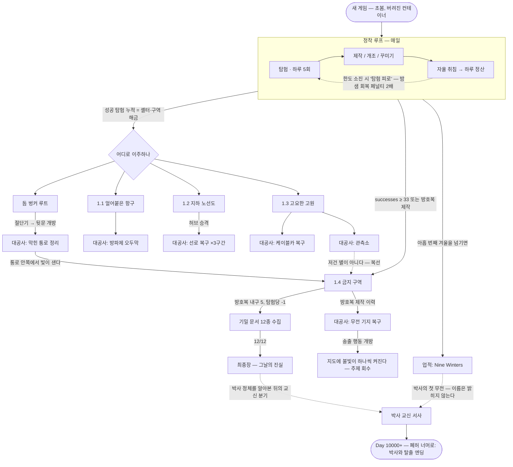

# Nine Winters — 루트별 시나리오 흐름도 (SCENARIO-FLOWS)

> 목적: "어떤 대공사를 하면 어떤 시나리오로 흘러가는가"를 한 장에 고정한다 (디렉터 오더, 2026-07).
> 상위 기준: [GD-THESIS.md](GD-THESIS.md) — *"세상이 끝나도, 삶은 계속 손질할 수 있다."*
> 유지 규약: 루트/대공사/서사 수집물을 추가·변경하는 배치는 **이 문서를 같은 커밋에서 갱신**한다.
> 수치의 원본은 코드다 — 여기 적힌 수치는 참조용이며, 충돌 시 `src/data/balance.js` · `src/data/projects.js`가 정답.

---

## 0. 한눈 흐름도

---

## 1. 공통 정착 루프 (모든 루트의 바닥)

| 단계 | 내용 | 시나리오 페이로드 |
|---|---|---|
| 탐험 | 하루 5회 한도, 에너지 20/회. 지역 풀에서 자원·(희귀)가구 | 지역 메모 드랍 **2%** (문서 희소화 — 종이 한 장이 귀한 세계) · 유서 2% |
| 라디오 | ON 상태 하루 1회 18% 청취 | 단파 방송 수집 (박사 조각 포함) |
| 정산 | **강제 없음** — 자율 취침 시(#88). 탐험 한도 소진일은 '탐험 피로'(밤샘 취침 회복 페널티 ×2, 21~23시 취침 무손해) | 아침 보고 · 인카운터(일 60%) |
| 계절 | 초봄 시작 → 사계 순환, 겨울이 압박의 축 | 겨울 넘김 카운트 = Nine Winters 마일스톤 |

이주 사다리: 컨테이너(외곽) → 버스/옥탑/오두막(도심·초지) → 온실/벙커 → 항구(1.1) → 지하철(1.2) → 로지(1.3) — 성공 탐험 누적(successes)이 해금 축. 금지 구역만 지역이지 셸터가 아니다.

---

## 2. 루트별 스토리보드

### 2-A. 돔 벙커 루트 — "잠긴 문 뒤에 공간이 있다"
1. **입주**: 정면 반달 파사드+닫힌 철문(밖에서 보임), 후면에 잠긴 철문 + **소형 돔이 상시 보인다**(공간이 먼저 존재 — 뒷문 개연성).
2. **천장 수리** (개조 2단계): 구멍(hole) → 방수포(temp) → 콘크리트(full). 악천후 오염 유입이 멎는다.
3. **절단기 입수** → **뒷문 개방**(bunkerBackdoor): 전실(저장고 선반+램프)과 **지하로 내려가는 계단**이 열린다. 계단 끝은 돌무더기.
4. **대공사 `clearPassage` (막힌 통로 정리)** — 큰 돌 걷어내기(3회 투입) → 잔해 쓸어내기(2회): 완공 시 통로 안쪽에서 **희미한 빛이 샌다**. 진입은 불가 — 1.4 복선.
5. **회수(1.4)**: 금지 구역에 닿은 뒤(successes 33+ 또는 방호복), 이 통로가 **연구동으로 이어져 있었다**는 사실이 수첩에 기록된다(`proj.clearPassage.revealNote`).

### 2-B. 1.1 「얼어붙은 항구」 — 바다는 주고, 바다는 막는다
- 셸터: 페리(ship) · 예인선(tugboat) · 관제탑(controltower) · 등대(lighthouse, 자급 개편).
- 항만 야적장: 날마다 부스트 품목이 바뀐다(결정론). 수산시장: 겨울 결빙 시 절반.
- **대공사 `breakwaterHut` (방파제 오두막)**: 잔해 정리(4) → 뼈대(3) → 마감(3).
  - 완공 효과: 항구 파밍 시간 -25% + 얼음낚시 스팟 +1.
  - 시나리오: 바람 막을 곳 하나가 항구 전체의 일과를 바꾼다 — "손질"의 물리적 증명.

### 2-C. 1.2 「지하 노선도」 — 어둠 속에 도시의 혈관이 남아 있다
1. **입주**(지하철 역사): 판데믹 지하 대피 서사의 본진 — 지하 메모 풀이 우선 드랍.
2. **허브 승격**(자재 3+부품 1, 핸드카 정비+노선도 복원): 역이 거점이 된다(subwayHub).
3. **대공사 `subRail1~3` (선로 복구 3구간)** — 구간마다 잔해 제거 → 침목 → 개통:
   | 구간 | 연결 지역 | 개통 효과 |
   |---|---|---|
   | seg1 | residential(주거) | 해당 지역 탐험 시간 -50% + **겨울 폭설 봉쇄 무시**(지하니까) |
   | seg2 | commercial(상업) | 〃 |
   | seg3 | industrial(공업, 최원거리) | 〃 |
4. 부속: 버섯 재배칸(어둠/연중, 옥탑 텃밭의 대칭축) · 암시장.
- 시나리오: 도시가 죽어도 노선도는 남는다 — 개통할수록 "겨울이 짧아지는" 체감.

### 2-D. 1.3 「고요한 고원」 — 마지막 휴가객들의 산
- 셸터: 스키 로지(lodge). 리조트 메모 풀 우선 드랍. 눈사태(탐험 우회) · 온천(개조: 쾌적 정점).
- **대공사 `cablecar` (케이블카 복구)**: 잔해(3) → 케이블(3) → 곤돌라(3) → 고원 접근/탐험 시간 단축. "접근 비용을 건설로 산다."
- **대공사 `observatory` (관측소)**: 기초(3) → 돔 골조(3) → 완성(3) → **맑은 밤 밤하늘 이벤트**(유성우/오로라, 스케치 수집). 숫자 보상 없음 — 감상 보상 원칙.
  - **복선**: 관측 스케치 중 하나 — *"저건 별이 아니다."* → 1.4 금지 구역의 하늘로 이어진다.

### 2-E. 1.4 「금지 구역」 — 세계관의 답이 있는 곳 (최종장 루트)
1. **노출**: successes ≥ 33 (또는 방호복 제작 이력). 지도에 검문소·지하 연구동이 뜬다.
2. **방호복**(부품 6+천 4+자재 2, 내구 5): 금지 구역 탐험 1회당 내구 -1. 다 닳으면 수리 전까지 진입 차단 — 리듬 게이트.
3. **기밀 문서 12종**: 금지 구역 탐험에서 우선 드랍(실효 5% — 기본 2%의 2.5배 밀도). **긴 추적** — 다 모으면 최종장 페이지 **「그날의 진실」**이 열린다(판데믹→핵전쟁 서사의 전모).
4. **대공사 `radioBase` (무전 기지 복구)**: 안테나(3) → 송신기(3) → 전원(3) → **송출 행동 개방**.
   - 송출 1회(에너지 15): 수집한 방송/기록 하나를 도시에 재송출 → **지도에 불빛이 하나 켜진다.**
   - 주제 회수: 혼자 살아남은 게 아니었다 — 손질한 삶이 신호가 되어 돌아온다.

### 2-F. 박사 교신 → 엔딩 (세로축: 시간이 쌓여야 열린다)
- **아홉 번째 겨울**을 넘기면(약 8년차) 업적 *Nine Winters* + **박사의 첫 무전**(이름 없음 — Day 10000 엔딩의 첫 복선).
- 기밀 문서를 다 읽었다면 **박사 정체를 알아본 교신 분기**(문안 한 줄 추가).
- **Day 10000+**: 하루 5% 구조 인카운터 → **「폐허 너머로」** 엔딩(박사와 탈출, 전용 OST). 엔딩 후에도 계속 살 수 있다 — 방치 생존의 존중.

---

## 3. 대공사 → 시나리오 매핑 (요약표)

| 대공사 | 조건 | 단계(투입) | 완공 효과 | 서사 갈고리 |
|---|---|---|---|---|
| 막힌 통로 정리 | 벙커 + 뒷문 개방 | 3 → 2 | 코스메틱+수첩 | 통로의 빛 → 연구동 복선 회수(1.4) |
| 방파제 오두막 | 예인선/관제탑 | 4 → 3 → 3 | 항구 파밍 -25%, 낚시 +1 | 바람을 막자 항구가 살아난다 |
| 선로 복구 ×3 | 지하철 허브 | 3~4 ×3구간 | 탐험 -50%, 폭설 무시 | 도시의 혈관이 다시 뛴다 |
| 케이블카 | 로지 | 3 → 3 → 3 | 고원 접근 단축 | 산이 가까워진다 |
| 관측소 | 로지 | 3 → 3 → 3 | 밤하늘 이벤트(감상) | "저건 별이 아니다" → 1.4 |
| 무전 기지 | 방호복 제작 이력 | 3 → 3 → 3 | 송출 개방 → 지도 불빛 | 주제 회수(신호가 되는 삶) |

## 4. 서사 수집물 매트릭스

| 수집물 | 풀 | 드랍처 | 게이트 |
|---|---|---|---|
| 지역 메모 | 지역별 | 탐험 성공 | 2% (지하철 거주=지하 풀 우선, 로지=리조트 풀 우선) |
| 유서 | 생존자들 | 탐험 성공 | 2% (REQ-LORE-01 밴드) |
| 기밀 문서 12종 | research | 금지 구역 탐험 | 실효 5% (기본의 2.5배 밀도) → 최종장 |
| 단파 방송 | BROADCASTS | 라디오 ON | 일 18% (박사 조각 2종 → 교신 분기) |
| 스케치 | 밤하늘 | 관측소 완공 후 맑은 밤 | 이벤트 |
| 수첩 "그 해의 공사" | memoir | 대공사 완공 시 자동 | — |

---

*작성: Fable (CTO) — v1.4.2 코드 기준 실측·대조. 디렉터 검수 후 확정.*
