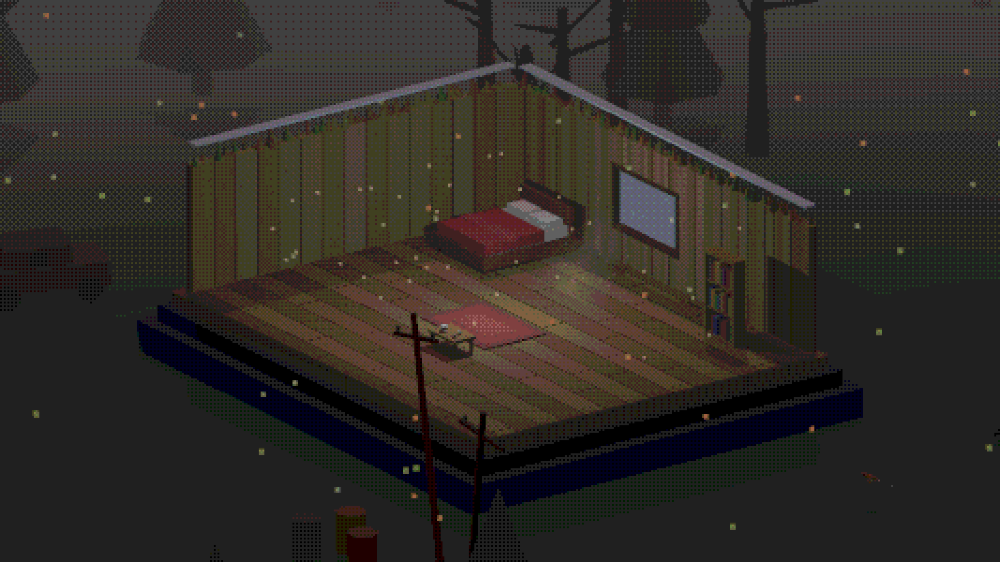
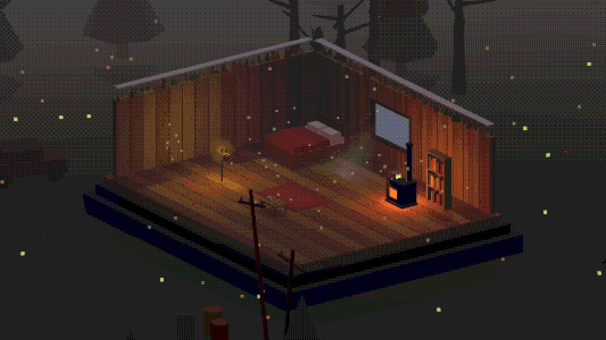
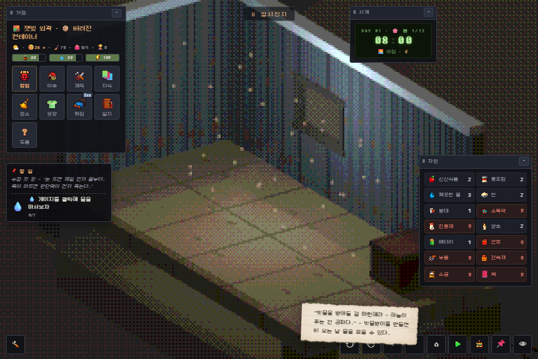
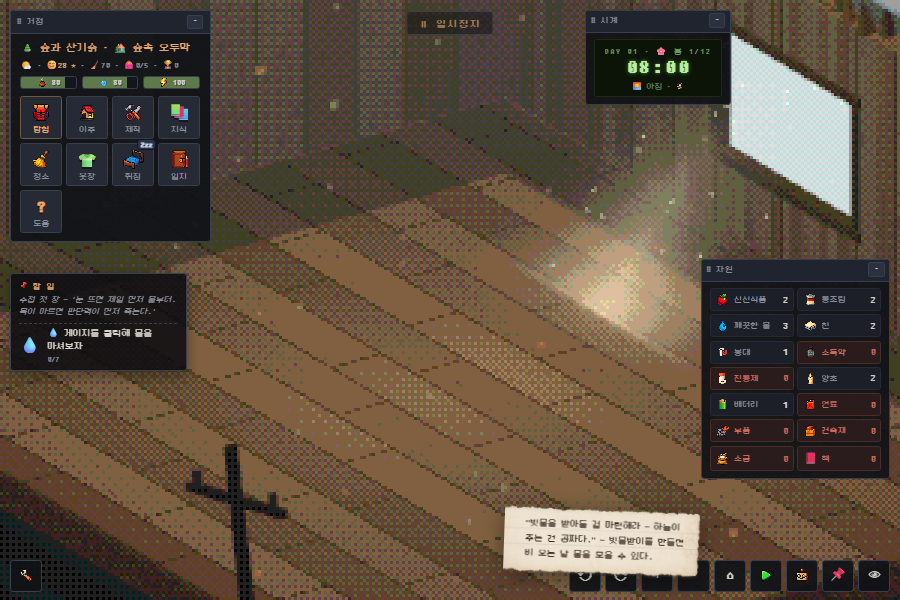
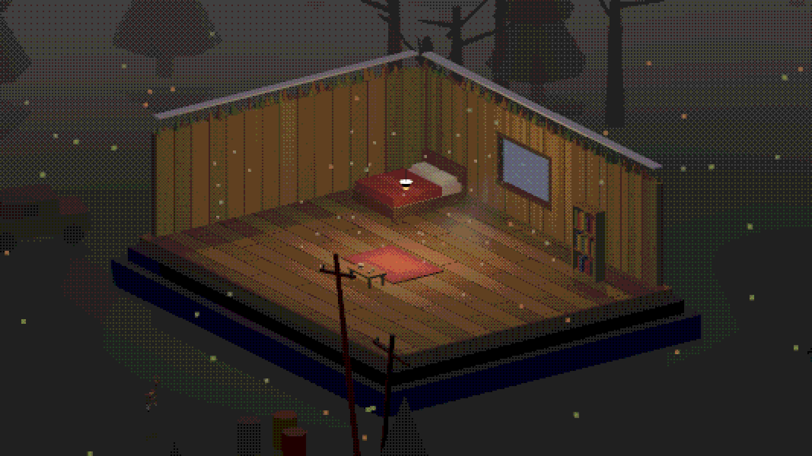
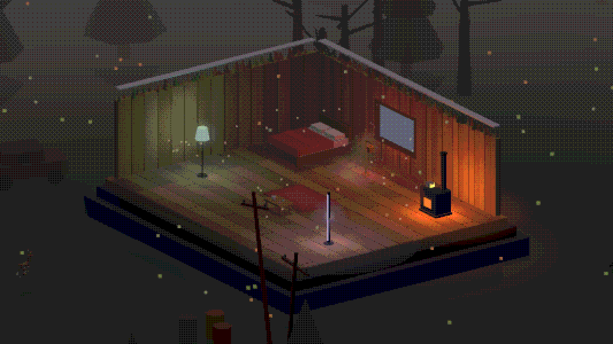

# Lighting Update 구현 보고서 (#189 · P1~P4 전 단계 완료)

> 작성: CTO Fable · 2026-07-16 · 스펙 정본: `docs/design/LIGHTING-UPDATE.md` (디렉터 구술 2026-07-15)
> 커밋: P1 `6c27972` · P2·3 `c39a4f7` · P4 `2154003` · 데모 재수렴 `625571c`
> 한 줄 요약: **빛이 거저 주어지는 것에서 관리·수집·표현의 대상으로** — 어둠은 압력, 빛은 보상.

---

## P1-a. 기본 상태 = 어둠 + 폴백 천장광

**무엇이 바뀌었나**: 실내 천장광(ceilLight)을 「무광원 폴백」으로 재정의했다. 살아 있는 광원이
하나도 없을 때만 켜지는 **죽은 형광등**(밝기 10/100 · 냉백 `0xcfe0e8` · 불안정 점멸)이고,
광원(가구 광원·화기·조명 설비)이 하나라도 있으면 소등된다. 낮에는 창으로 드는 햇빛이 유일한 자연광.

**구현 방식** (`src/game.js`):
- **광원 레지스트리** `interiorLightActive()` — 배치 아이템 중 `DEFS[..].light && on !== false`
  (난로·랜턴·양초·스탠드 등 화기 포함) 또는 급전 중인 조명 설비를 집계.
- `updateLightingRig()`가 **렌더 루프 매 프레임** 폴백/설비 광원을 동기화 — 전원 토글·연료 소진·
  설비 설치가 별도 배선 없이 즉시 반영된다. §9.6 지하철 잔불(세기 2)은 그대로 유지.
- 폴백일 때만 점멸이 보인다(노후 형광등 톤). `reduceMotion`이면 고정.

| 무광원 폴백 (밤) | 화기 점등 (난로+랜턴) |
|---|---|
|  |  |

| 밤의 어둠 (인게임 UI) | 낮 — 창 빛기둥이 유일한 빛 |
|---|---|
|  |  |

**검증**: 코어 게이트 「폴백 게이트」— 광원 0=폴백 10 → 랜턴 배치=0 → 연료 소진 자동 꺼짐=10 복귀.
골든 19장이 어둠 기본값 기준으로 재핀됨(이후 라이팅 수정 시 골든 재핀 필수).

---

## P1-b. 조명 설비 (셸터 개조) + 전력 경제

**무엇이 바뀌었나**: 개조 항목 「조명 설비」 신설 — 설치하면 천장 펜던트(전선+금속 갓+전구 소품)가
달리고 방 전체가 따뜻하고 **안정적인**(점멸 없음 — 화기의 흔들림과 대비축) 전등빛으로 밝아진다.
**배터리 1/일** 지속 소모. 끊기면 자동 소등(전구도 꺼짐) + 아침 노트, 배터리가 다시 생기면 자동 재점등.

**구현 방식**:
- `SHELTER_MODS.lighting` (부품 3 + 배터리 1, `rebuild: true` — 설치 즉시 셸터 재로드로 소품 등장).
- `facilityLight` PointLight(웜 `0xffd9a0` · 세기 16 · 거리 = 방 크기 + 6) + 펜던트 복셀 소품.
- `processDay` 전력 틱: 발전기 가동 시 무료(freePower 승계), 단전/복구는 전이 시에만 노트 1줄.
- 세이브: `state.lightingOut` (단전 상태 지속).

| 조명 설비 점등 | 단전 — 폴백 어둠 복귀 + 죽은 전구 |
|---|---|
|  |  |

**검증**: 게이트 「조명 설비」(점등·1/일 소모·단전 소등+노트) + 「발전기 무료 급전」(배터리 불변·재점등).

---

## P2. 태양광 지속 급전 승격

**무엇이 바뀌었나**: 태양광 패널이 「이틀에 배터리 +1」 생산기에서 **지속 급전원**으로 승격 —
설치돼 있으면 조명·가전의 배터리 소비가 무료다(주간 충전 픽션, 상시 적용). 발전량(이틀 +1)은
기존 캘리브레이션 그대로. 이로써 밸런스 축이 완성된다:

> **어둠**(무비용·우울) ↔ **화기**(연료·온기·흔들림) ↔ **전기조명**(전력·안정) ↔ **태양광**(초기투자 → 무한)

**구현 방식**: `processDay`의 발전기 freePower 로직을 `hasMod('solar')`가 승계. 아침 노트는
실제 전기 부하(조명 설비·배터리 가전)가 있는 날만 출력(스팸 방지). 경제 핀 무변(밴드 테스트 그린).

**검증**: 게이트 「태양광 지속 급전」— 발전기 연료 소진 → 태양광 승계(드레인 0) + 이틀 생산 +1 + 노트.

---

## P3. 조명 색 파밍 — 「조명 젤 필터북」

**무엇이 바뀌었나**: 전설급 1회 한정 파밍 아이템 **조명 젤 필터북** — 상업지구·도심에서만
(극장/스튜디오 유품, 확률 0.02) 드랍. 보유하면 전기·유리 계열 광원(스탠드·걸이 랜턴·책상 램프·LED)의
편집 카드에 **빛 색 스와치 행**이 열린다. 도료 1통 = 조명 1회 틴트(도색 게이트 문법 재사용), 원색 복원은 무료.
**화기(촛불·난로)는 제외** — 불꽃엔 필터를 씌울 수 없다(디제시스).

**구현 방식**:
- 드랍: `resolveExpedition` 전설 롤 + 잭팟 프레임. `state.lightGels` 플래그(1회 한정).
- 적용: `applyGel(item)` — PointLight 색 + 헤일로 스프라이트 + 발광 메시 emissive + 바닥 라이트 풀을
  도료 계열 스와치 색으로 동시 틴트. `def.light.gelable` 플래그로 대상 게이트.
- 세이브: 레이아웃 `ge` 필드 — 재빌드(도색·티어 손질)·이주·재로드에도 색 유지.

**검증**: 게이트 「조명 젤」— 적용(라이트+헤일로 hex 일치)·세이브 왕복·원색 복원·화기 제외 플래그.

---

## P4. LED 라이트 바 (초희귀) + 「감동」 연출 v1

**무엇이 바뀌었나**:
- **LED 라이트 바**: 신규 광원 가구 — 수직 스탠드 바, 선명한 쿨화이트, **무점멸**(안정광), 젤 틴트 가능.
  전 지역 초희귀 도면(0.012 · 별도 롤 · 발견 컷), 제작 부품 3+배터리 2. 도감에 「초희귀」 행.
  화기(따뜻·흔들림)의 대척 — 표현 스펙트럼의 끝.
- **바닥 라이트 풀**: 모든 광원과 조명 설비 아래에 부드러운 빛 웅덩이(가산 원형 그라데이션 **딱 1겹**,
  저오퍼시티 0.12~0.13). 전원 토글·젤 틴트에 연동. 스택 배치(테이블 위)면 상판 위 웅덩이가 된다.
  블룸 남발 금지 원칙(§4 픽셀 정합) 준수 — 색 섞임은 풀들의 중첩이 자연스럽게 만든다.

*캐빈 밤 20시: 세이지(젤) 스탠드 · 라벤더(젤) LED 바 · 원색 난로 — 바닥 풀이 3색을 섞는다.*

**검증**: 게이트 「LED 바+라이트 풀」(도면 채널·무점멸·풀 전원 연동·젤 틴트 hex 일치).

---

## 종합 검증 현황

| 게이트 | 결과 |
|---|---|
| 코어 배터리 (조명 게이트 6종 포함) | **87/87 그린** (트렁크·데모 브랜치 동일) |
| 골든 19장 (어둠 기본값 재핀) | 19/19, 재핀 후 2연속 안정 |
| 모달 골든 | 7/7 |
| i18n | 트렁크 2075키 / 데모 2108키 무결 |
| 데모 Day-15 컷 E2E | 4/4 (컷 발화→크레딧→CTA) |
| 데모 번들 조명 스모크 | 폴백·설비·태양광·젤·LED·풀 전부 ✓ |

## 후속 여지 (스펙 §4 잔여 — 디렉터 톤 오더 대기)
- 진짜 포스트 블룸(포스트체인 확장) · 젖은 표면 반사 스트릭과 광원 연동 — 현 라이트 풀의 상위 버전.
- 조명 설비 수동 on/off 토글(현재는 배터리 유무 자동) — 절전 플레이 손맛이 필요하면.
